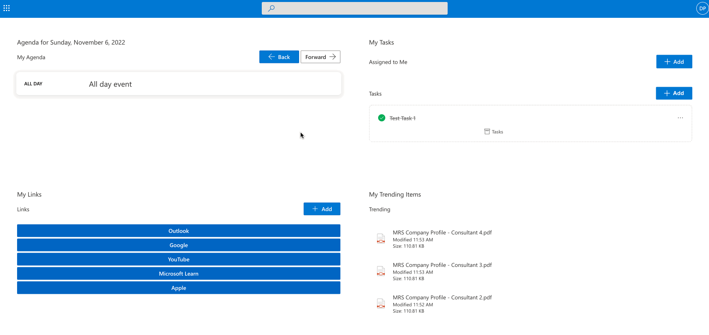

# sp-personal-dashboard

## Summary

Provides a personalized dashboard displaying tasks, meetings, custom personal links and trending files in one easy and organized view. Supports AppPage, full width sections, and Microsoft Teams.



## Used SharePoint Framework Version


## Applies to

- [SharePoint Framework](https://aka.ms/spfx)
- [Microsoft 365 tenant](https://docs.microsoft.com/en-us/sharepoint/dev/spfx/set-up-your-developer-tenant)

> Get your own free development tenant by subscribing to [Microsoft 365 developer program](http://aka.ms/o365devprogram)

## Prerequisites

> This solution uses Yarn package manager. Either install Yarn globally with npm or delete the yarn.lock file and reinstall dependencies with npm.

## Solution

| Solution    | Author(s)                                               |
| ----------- | ------------------------------------------------------- |
| sp-personal-dashboard | [MRS Company Ltd](https://mrscompany.com) |

## Version history

| Version | Date             | Comments        |
| ------- | ---------------- | --------------- |
| 1.0     | November 6, 2022 | Initial release |

## Disclaimer

**THIS CODE IS PROVIDED _AS IS_ WITHOUT WARRANTY OF ANY KIND, EITHER EXPRESS OR IMPLIED, INCLUDING ANY IMPLIED WARRANTIES OF FITNESS FOR A PARTICULAR PURPOSE, MERCHANTABILITY, OR NON-INFRINGEMENT.**

---

## Minimal Path to Awesome

```bash
git clone {repo} # Clone repository
cd sp-personal-dashboard # Move to project directory
yarn # Install dependencies
gulp serve # Run development environment
gulp build # Build solution
gulp bundle --ship # Bundle solution for prod
gulp package-solution --ship # Create sppkg file for upload
```

Then upload the /sharepoint/solution/sp-personal-dashboard.sppkg file to your App Catalog.

## Features

This webpart provides a dashboard pulling in the following information:

- Meetings (Outlook/Exchange)
- Tasks from Planner (Assigned to Me tasks) and To Do (all lists)
- Personal links
- Trending documents

This extension illustrates the following concepts:

- Microsoft Graph Toolkit components
- Trending content
- SharePoint Open Extensions (for custom links)

## References

- [Getting started with SharePoint Framework](https://docs.microsoft.com/en-us/sharepoint/dev/spfx/set-up-your-developer-tenant)
- [Building for Microsoft teams](https://docs.microsoft.com/en-us/sharepoint/dev/spfx/build-for-teams-overview)
- [Use Microsoft Graph in your solution](https://docs.microsoft.com/en-us/sharepoint/dev/spfx/web-parts/get-started/using-microsoft-graph-apis)
- [Publish SharePoint Framework applications to the Marketplace](https://docs.microsoft.com/en-us/sharepoint/dev/spfx/publish-to-marketplace-overview)
- [Microsoft 365 Patterns and Practices](https://aka.ms/m365pnp) - Guidance, tooling, samples and open-source controls for your Microsoft 365 development
